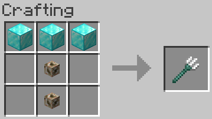

# Trident

In Minecraft Java Edition the drop chance of a player getting a Trident from a Drowned is approximately 8.5 percent.  
I have implemented a crafting recipe in to the plugin so that it is there, but it's an expensive item, to still encourage players to collect the rare item.

