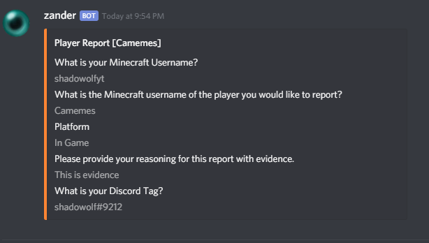

# Report Command

This command is fairly simple. This command is a multi-platform command and feature since you can report users form 3 places \(in-game, Discord and the website \(/report\)\).

## Minecraft


**Command:** /report  
**Usage:** /report \[username\] \[reason\]


If the user is to execute the command /report with it's correct usage 2 things happen.  
Users who are Server Operators or who have the `zander.reportnotify` permission node will have a message appear in chat.

The second action is that it takes the same text and puts it in an embed message and sends it to the configured reports channel \(it's \#reports by default\).

## Website

On the website the user is to complete the report form. On submission 2 actions occur.  
The first action is that it takes the form and puts it in an embed message and sends it to the configured reports channel \(it's \#reports by default\).

The 2nd action is that a formatted template email is sent to the email address in the `notificationemail` configuration setting.


The email feature will not work if the `mailsend` option is set to false.


