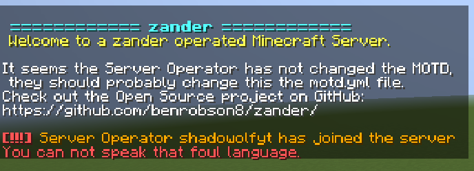

# Swear Filter

Using the filtered words option which you can find in the filter.yml You can declare a list or range of words of your choosing in that yml file to block across discord and the Minecraft platform.  
If the user was to use a word that gets triggered by the filter it promptly removes the message and sends them a little message saying you shouldn't use that word, but the message or sentence that it sends can be changed in the lang.yml file.

