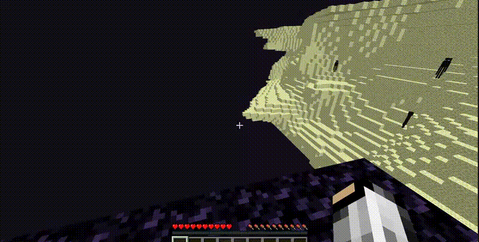

# End Void Safety

Sometimes when you're playing Minecraft and you're in the end or and you're above the void you just hate falling into the void and losing all of your stuff unless you have keep inventory on of course, but if you don't it would suck.

One of the built-in features is that if a player is to jump or fall into the void they will be teleported back to the overworld to either world spawn or to their spawn point or bed and die you do die but it's a great form of safety that you actually keep your items.

