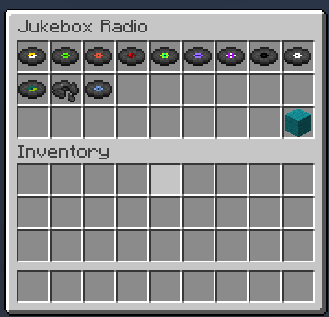

# Jukebox Radio


**Command:** /jukebox  
**Permission:** `zander.jukebox`


The Jukebox Radio which can be executed with /jukebox which requires permissions of `zander.jukebox` will open a graphical user interface to the player where you can select and play any disc that is currently in the game.

Personally, when I host servers I create a custom resource pack and put other music over it so the jukebox radio is actually really helpful with this. The best function for the jukebox radio is you can easily open up the interface, select a song and then just keep walking around and do whatever you were doing.

